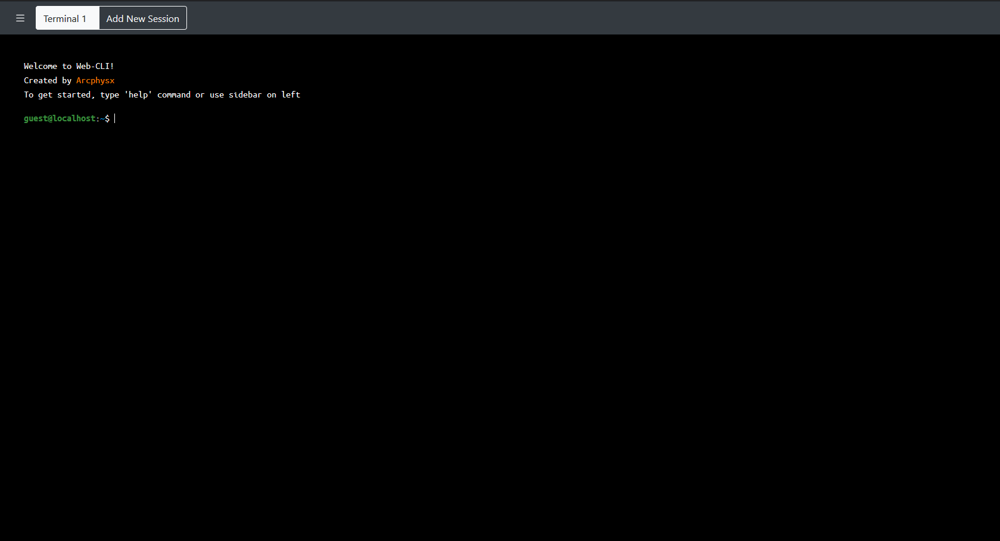
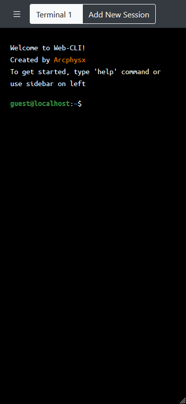

# Web CLI (_WCLI_)
_Last Updated: `07/08/2020`_

Simple and fully customizable Command Line Interface web page

## Demo
You can view the demo on [My Personal Website](https://arcphysx.com/)

## Features
* Fully customizable command, even you can create your own command with your own parameter
* Some bash-like command are included
* Multi terminal sessions are supported

## Screenshots
<table style="text-align: center;">
    <tr>
        <td></td>
        <td></td>
    </tr>
    <tr>
        <td>Web Version</td>
        <td>Mobile Version</td>
    </tr>
</table>

## Requirements
* Vue 2.6 or later

## Prerequisites
### Preparing Projects
* Clone this projects on your directory
* Run `npm install` command to install the dependencies
* Run `npm run serve` to run the project

### Configuring the CLI
* You can modify the config on `constant\cli_config.js`
* You can create your own JS module for processing command in `utils`, for example, see `utils\commandHandler.js`

### Notes
This project uses [BootstrapVue](https://bootstrap-vue.org/) for creating pages and utilizes its grids and components to build layouts.

## Authors
**Raymond Purnomo** ([Website](https://arcphysx.com)) ([Email](mailto:arcphysx@gmail.com))